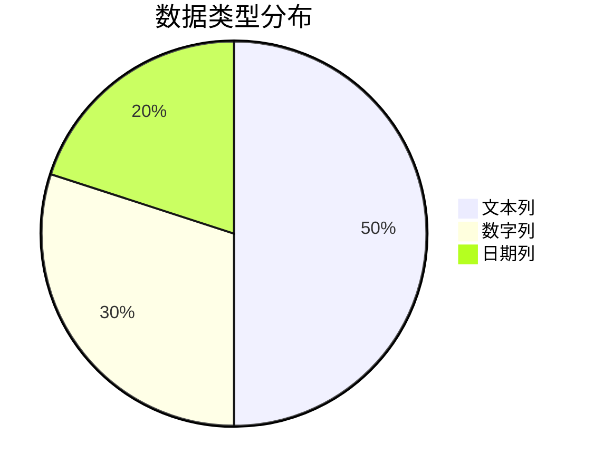

# MDC Excel Scanner — 表格扫描器

## 定位

本 Skill 是 MDC Hub 的**表格类子 Skill**，负责分析 Excel（.xlsx/.xls）和 CSV（.csv/.tsv）文件。

## 扫描粒度

- 每个 Excel 文件 → 1 个文件级总览节点
- 每个工作表（Sheet）→ 1 个独立节点（可选，复杂文件拆）
- CSV 文件 → 1 个节点

## 工作流程（3 步）

### 第一步：扫描表格文件

1. 调用 `scan_directory`，`file_types=["表格"]`
2. 调用 `read_files` 读取文件内容（CSV 可直接读，Excel 需要 AI 从内容推断结构）
3. 提取：

| 提取项 | 说明 |
|--------|------|
| 文件名 | 含后缀 |
| Sheet 列表 | 工作表名（Excel 特有） |
| 列结构 | 列名 + 数据类型推断 |
| 行数 | 大致数据量 |
| 关键列 | 主键/外键列 |

### 第二步：生成文档

**文件级总览**（每个 .xlsx/.csv 一份）：

归档路径：`.mdc-hub/docs/{相对路径}/{文件名}.md`

```yaml
id: "{文件名-kebab}"
title: "{文件名} — {用途/场景}"
category: "数据/{业务域}"
tags: ["excel", "数据", "{业务标签}"]
connections: []
```

正文：
```markdown
## 概述
该数据表的用途、数据来源、更新频率。

## 工作表列表
| 工作表 | 行数 | 说明 |
| Sheet1  | 500  | 客户主数据 |

## 列结构（以第一个 Sheet 为例）
| 列名 | 类型 | 说明 | 示例值 |
| ID   | 数字 | 主键 | 10001 |

## 数据分布


## 关联
- 被 `ImportService` 读取（见 `import-service` 节点）
- 数据导出到 `report-dashboard`
```

**工作表级节点**（仅复杂 Excel 需要拆，每 Sheet 一份）：

```yaml
id: "{文件名-kebab}.{sheet名}"
title: "{文件名} — {Sheet名}"
category: "数据/{业务域}/{文件名}"
connections:
  - target: "{文件名-kebab}"
    relation: "属于"
```

### 第三步：建立连线

| 关系 | 场景 |
|------|------|
| `属于` | Sheet → 文件 |
| `引用` | 代码/服务 → 表格 |
| `关联` | 多个表格之间有外键/业务关联 |

## 注意事项

- 大文件（>10MB）只扫描结构不读全文
- Excel 文件无法直接读取时，AI 根据文件名和路径推断内容
- 优先关注与代码有交互关系的表格
