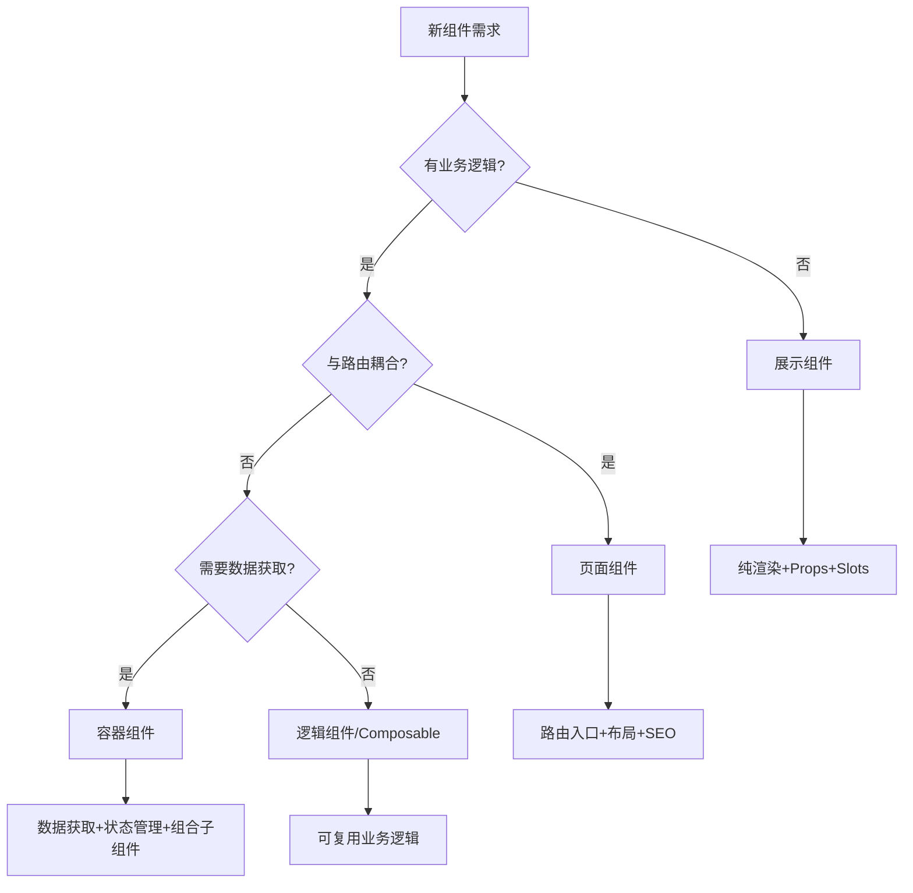

# 组件设计原则与模式

## SOLID 原则在组件中的应用

### 单一职责 (SRP)
每个组件只负责一个功能。例如：
- `UserAvatar` — 只管头像展示
- `UserProfile` — 组合多个子组件
- `UserProfilePage` — 数据获取 + 布局

### 开闭原则 (OCP)
通过 props、slots、render props 扩展组件，而非修改源码。

## 组件分类

| 类型 | 职责 | 示例 |
|------|------|------|
| 展示组件 | 纯渲染，无业务逻辑 | Button, Card, Badge |
| 容器组件 | 数据获取、状态管理 | UserListContainer |
| 页面组件 | 路由入口、布局 | DashboardPage |

## 组合优于继承

```tsx
// 好：组合
function Page({ children }) {
  return (
    <div className="page">
      <Header />
      {children}
      <Footer />
    </div>
  )
}

// 差：继承
class Page extends BasePage { ... }
```

## 组件分类决策树



## 组件通信

- 父→子：props
- 子→父：回调 / emit
- 跨层级：provide/inject 或 Context
- 全局：状态管理库
