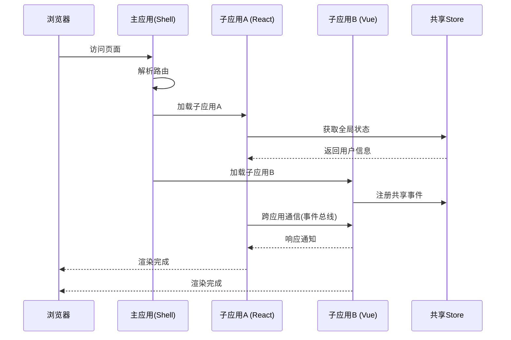

# 微前端架构设计

## 方案对比

| 方案 | 特点 | 适用场景 |
|------|------|---------|
| Module Federation | Webpack 原生 | 技术栈统一 |
| qiankun | 基于 single-spa | 多技术栈 |
| Micro-Frontend iframe | 隔离最强 | 遗留系统 |

## 微前端应用加载时序

## 核心挑战

1. **样式隔离** — CSS 污染问题
2. **状态共享** — 跨子应用通信
3. **路由协同** — 统一路由管理
