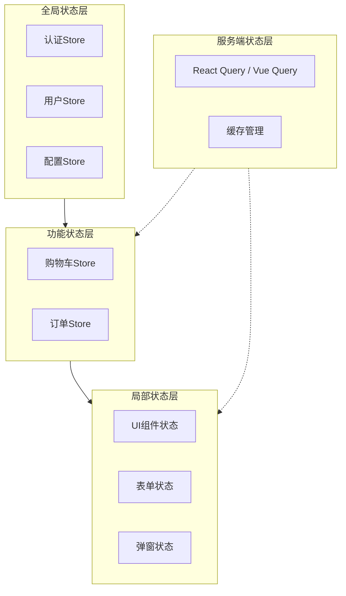

# 前端状态管理方案选型

## React 生态

| 方案 | 适用场景 | 复杂度 |
|------|---------|--------|
| useState + Context | 小型应用 | 低 |
| Zustand | 中小型应用 | 低 |
| Jotai | 原子化状态 | 中 |
| Redux Toolkit | 大型应用 | 高 |

## Vue 生态

| 方案 | 适用场景 |
|------|---------|
| ref + provide/inject | 组件级状态 |
| Pinia | 推荐方案，官方标配 |

## 选型原则

1. **不要过早引入状态管理库** — 先用框架内置方案
2. **按需加载** — 避免将所有状态放在全局 store
3. **服务端状态** — 用 React Query / Vue Query 管理，不要手动
4. **表单状态** — 用 React Hook Form / VeeValidate

## 状态管理层级架构

## 状态分类

| 类型 | 示例 | 存储位置 |
|------|------|---------|
| UI 状态 | 弹窗、加载态 | 组件内部 |
| 路由状态 | 当前页面 | 路由库 |
| 业务状态 | 用户、订单 | Store |
| 缓存状态 | API 响应 | Query 库 |
