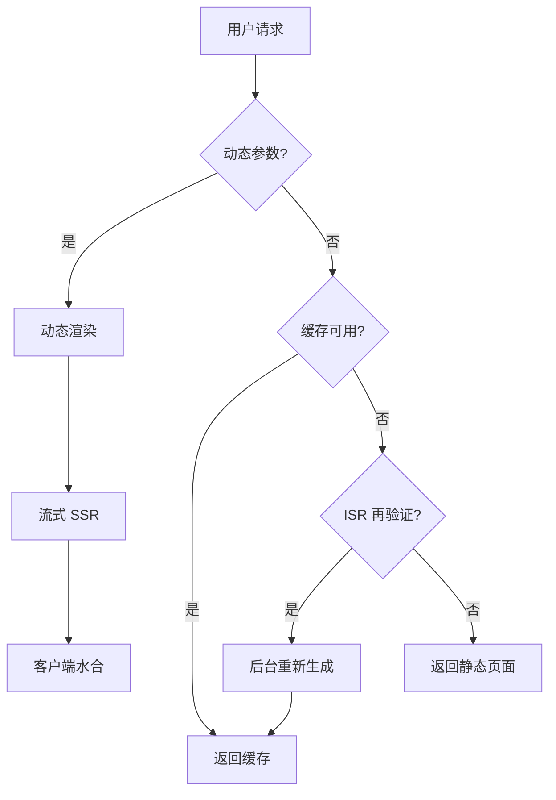

# Next.js App Router 架构

## 文件约定

| 文件 | 作用 |
|------|------|
| page.tsx | 页面路由 |
| layout.tsx | 共享布局 |
| loading.tsx | Suspense 加载态 |
| error.tsx | 错误边界 |

## 路由与渲染决策流程

## 渲染策略

- **Static**（默认）：构建时预渲染
- **Dynamic**：请求时渲染
- **ISR**：增量静态再生成
