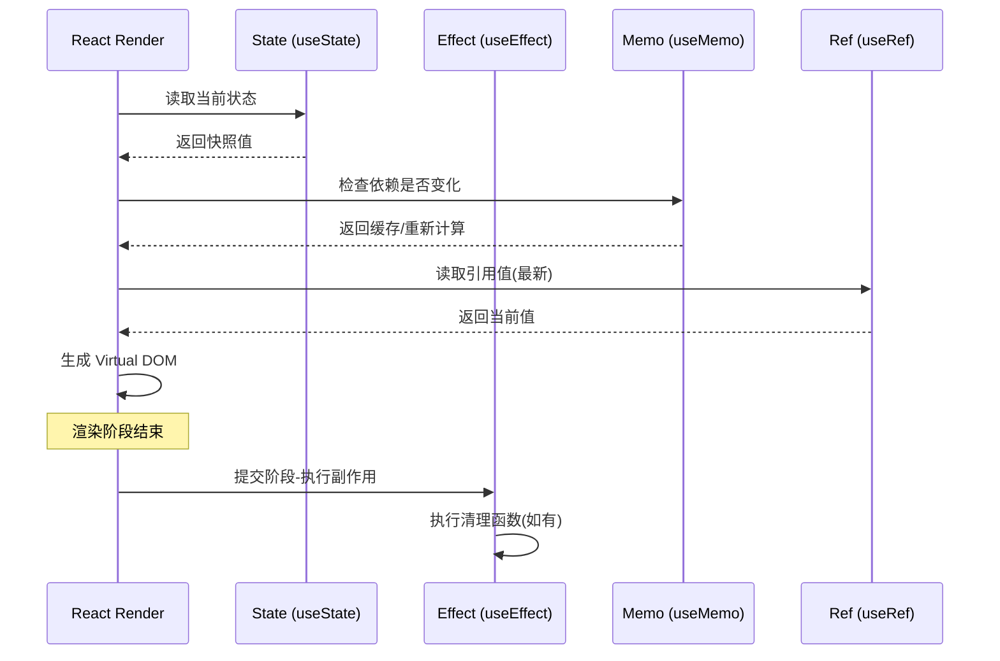

# React Hooks 深度总结

## 基础 Hooks

### useState
状态管理的基础 Hook，适用于组件级别的简单状态。

```tsx
const [count, setCount] = useState(0)
```

### useEffect
处理副作用，包括数据获取、订阅、DOM 操作等。注意依赖数组的优化和清理函数的正确使用。

## 进阶 Hooks

### useMemo / useCallback
用于性能优化，缓存计算结果和回调函数引用。但要避免过早优化——只在确实有性能瓶颈时使用。

### useRef
不仅能引用 DOM，还能保存跨渲染周期的可变值。常用于管理定时器、保存前值等场景。

## 自定义 Hooks

合理抽取自定义 Hook 是 React 代码复用的核心手段。一个好的自定义 Hook 应该：
- 以 `use` 开头
- 只做一件事
- 有清晰的输入输出

## Hook 数据流与渲染时序



## 常见陷阱

1. 闭包陷阱 — 在 setTimeout 中使用过期的 state
2. 依赖数组遗漏 — 导致 stale closure
3. useEffect 中的无限循环 — 依赖了每次渲染都变化的对象
