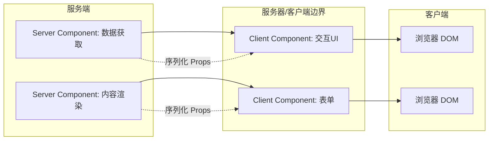

# React Server Components

## 核心概念

RSC 允许组件在服务端渲染，直接访问后端资源，减少客户端 JS 体积。

## 与 Client Components 的边界

- Server Components：默认，不能使用 hooks、事件处理
- Client Components：需要在文件顶部标注 `'use client'`

## 数据流

```
Server Component (fetch data)
  → Client Component (interactivity)
    → Server Component (more data)
```

## RSC 渲染架构



## 最佳实践

1. 尽可能将组件作为 Server Component
2. 只在需要交互时将组件标记为 Client
3. 避免将整个页面树都变成 Client Component
