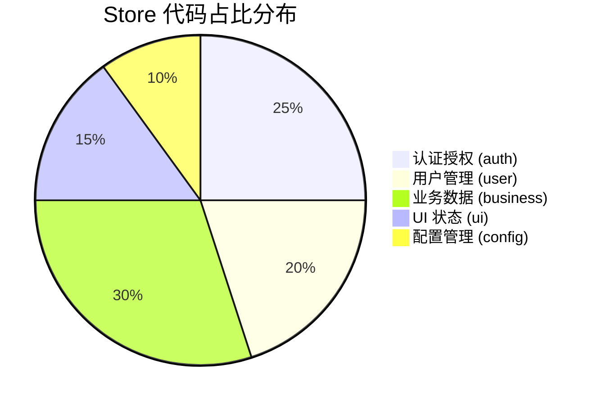

# Pinia 状态管理最佳实践

## 与 Vuex 对比

Pinia 是 Vuex 的继任者，提供：
- 完整的 TypeScript 支持
- 无需 mutations
- 多个 store 无需嵌套

## Store 组织方式

```
stores/
  ├── auth.ts      # 认证状态
  ├── user.ts      # 用户信息
  └── ui.ts        # UI 状态
```

## 典型 Store 职责分布



## 最佳实践

1. 按功能领域拆分 store
2. 避免跨 store 的循环依赖
3. 复杂逻辑抽取为 composable
