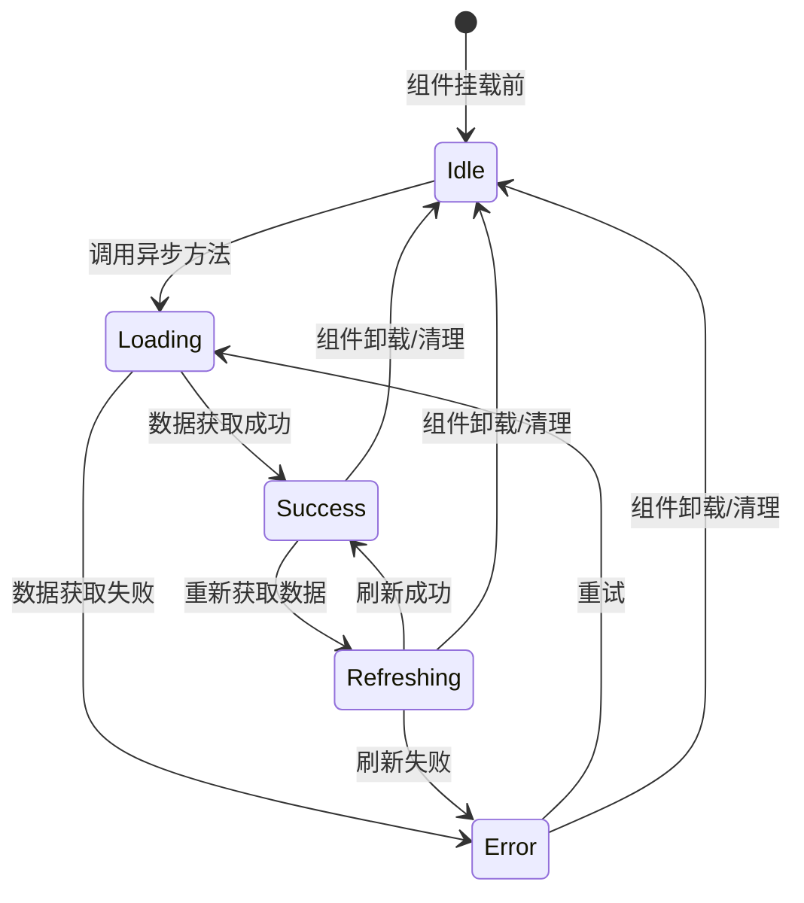

# Vue 3 Composables 设计模式

## 与 React Hooks 的对比

Vue 的 Composables 在概念上与 React Hooks 类似，但在实现上有本质区别：
- Vue 基于响应式系统 (ref/reactive)，不需要依赖数组
- 没有 Hook 调用顺序的限制
- 可以写在条件语句和循环中

## 最佳实践

### 单一职责
每个 Composable 只负责一个关注点。例如：
- `useAuth()` — 只管认证
- `useFetch()` — 只管数据获取

### 返回约定
```ts
// 推荐：返回包含数据和方法的对象
export function useCounter() {
  const count = ref(0)
  const increment = () => count.value++
  return { count, increment }
}
```

### 副作用清理
在 `onUnmounted` 中清理定时器、事件监听等。

## Composable 生命周期状态机



## 性能考量

- 避免在 Composable 中创建不必要的响应式对象
- 使用 `shallowRef` 处理大型只读数据
- 合理使用 `computed` 而非 `watch` 来计算衍生状态
