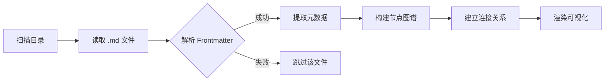

# MDC 文件格式规范

## Frontmatter 字段说明

| 字段 | 必需 | 类型 | 说明 |
|------|------|------|------|
| id | 是 | string | 全局唯一标识 |
| title | 是 | string | 节点显示标题 |
| category | 否 | string | 分类 ID，从 `.mdc-hub/config/categories.yaml` 选取，如 `frontend-core` |
| tags | 否 | string[] | 标签数组，用于图层筛选 |
| connections | 否 | object[] | 关联节点列表 |
| summary | 否 | string | AI 生成的摘要 |

## Connection 结构

```yaml
connections:
  - target: "other-node-id"
    relation: "依赖|前置|关联|实现"
```

## MDC 文件处理流程



## 最佳实践

- `id` 使用 kebab-case，具备语义性
- `category` 使用预设分类库中的扁平 ID
- `tags` 控制在 5 个以内，保持精准
- 正文采用标准 Markdown 格式
