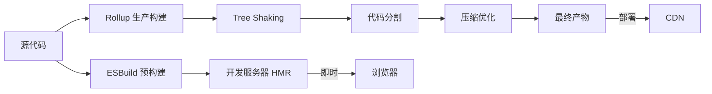

# Vite 构建工具配置指南

## 核心特性

- 开发环境使用 ESBuild，快
- 生产构建使用 Rollup，稳
- 原生 ESM，无需打包

## Vite 构建管线



## 常用配置

```ts
export default defineConfig({
  plugins: [vue(), react()],
  resolve: {
    alias: { '@': '/src' }
  },
  server: { port: 3000 }
})
```
